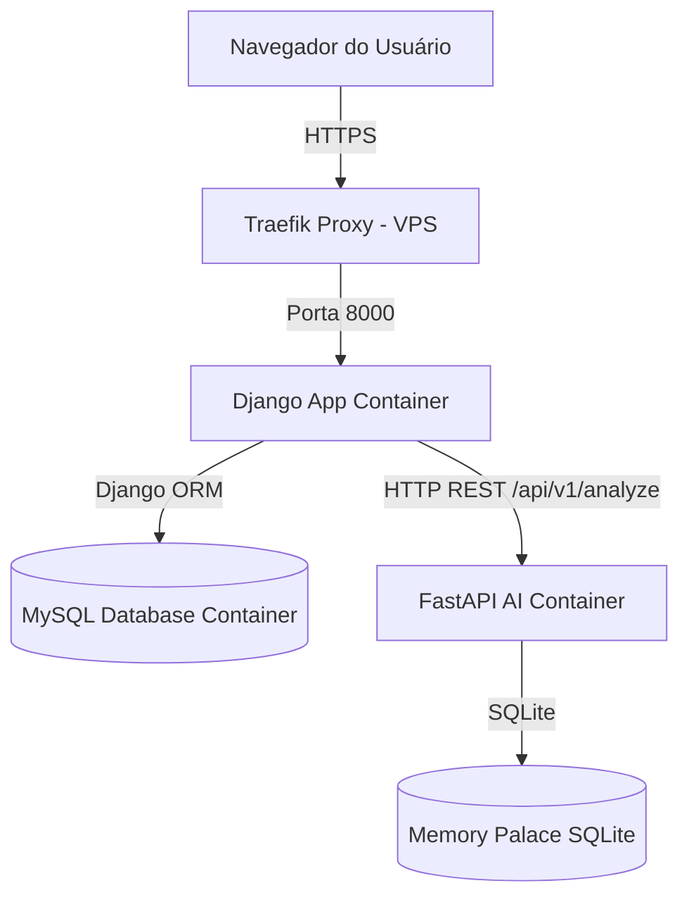

# Arquitetura do Sistema

Este documento detalha o desenho arquitetural da aplicação.

## 🏗️ Visão Geral da Arquitetura

O sistema adota uma arquitetura de microsserviços de 3 camadas principais (Web App, AI Service, Database) orquestrados com Docker Compose e expostos através de um Proxy Reverso (Traefik) com TLS automático.

## 📦 Detalhes dos Contêineres (VPS Hostinger)

### 1. Traefik Proxy (`traefik:latest`)
* **Função**: Roteamento HTTP/HTTPS, terminação TLS automatizada via Let's Encrypt.
* **Configuração**: Mapeia o domínio `neuro-diagnosis.tech` diretamente para a porta 8000 do contêiner `app`.

### 2. Web App Container (`neuro-diagnosis-app`)
* **Função**: Serve as páginas web, gerencia sessões, autentica usuários, persiste fichas e anamneses de pacientes.
* **Backend**: Django 4.2 executando com Gunicorn.
* **Armazenamento**: Mapeado para o contêiner `db`.

### 3. AI Service Container (`neuro-diagnosis-ai`)
* **Função**: Executa análises heurísticas locais e busca semântica de base de conhecimento clínico (DSM-5-TR).
* **Backend**: FastAPI com Uvicorn.
* **Armazenamento**: Volume local persistente para `memory_db/memory_palace.db`.

### 4. Database Container (`neuro-diagnosis-db`)
* **Função**: Persistência estruturada de dados da aplicação.
* **Motor**: MySQL 8.0.
* **Segurança**: Chaves e credenciais injetadas por variáveis de ambiente.

## ⚠️ Pontos Críticos e Legados

* **Convivência Django/Flask**: A raiz do projeto possui arquivos Flask (`app.py`, `app_database.db`, `responses.db`) que não são utilizados pela imagem Docker de produção (que usa Django/Gunicorn). Isto gera redundância e complexidade na estrutura de arquivos.
